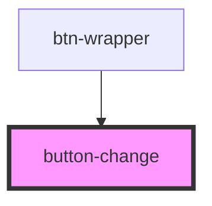

# button-change

<!-- Auto Generated Below -->

## Properties

| Property | Attribute | Description              | Type     | Default     |
| -------- | --------- | ------------------------ | -------- | ----------- |
| `label`  | `label`   | text shown inside button | `string` | `undefined` |

## Events

| Event         | Description                          | Type               |
| ------------- | ------------------------------------ | ------------------ |
| `changeClick` | Event emitted when clicked on button | `CustomEvent<any>` |

## Dependencies

### Used by

 - [btn-wrapper](../btn-wrapper)

### Graph

----------------------------------------------

*Built with [StencilJS](https://stenciljs.com/)*
